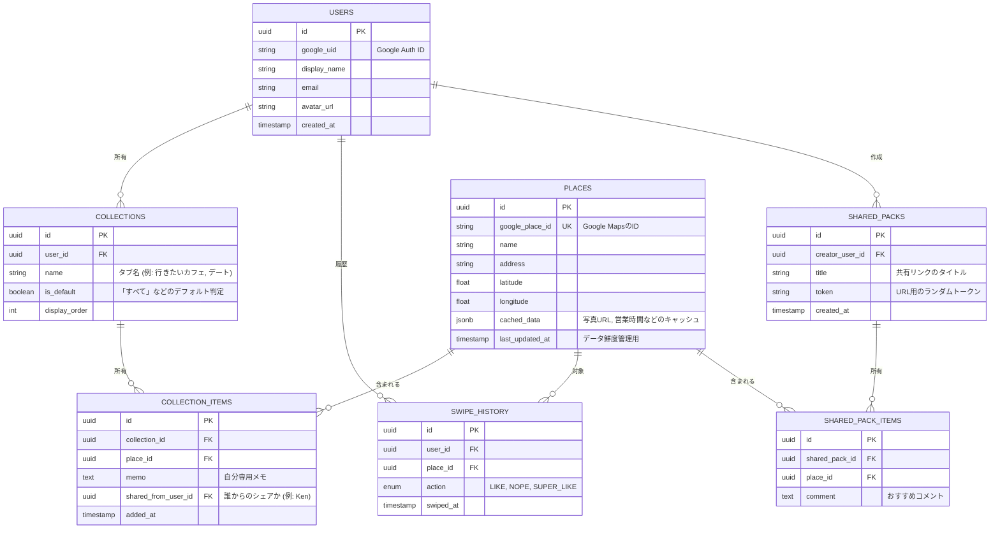

```mermaid
erDiagram
    %% ユーザー管理
    USERS ||--o{ COLLECTIONS : "所有"
    USERS ||--o{ SWIPE_HISTORY : "履歴"
    USERS ||--o{ SHARED_PACKS : "作成"

    %% 場所 (Google Mapsデータのキャッシュ + 独自メタデータ)
    PLACES ||--o{ COLLECTION_ITEMS : "含まれる"
    PLACES ||--o{ SWIPE_HISTORY : "対象"
    PLACES ||--o{ SHARED_PACK_ITEMS : "含まれる"

    %% コレクション (「カフェ」「デート」などのタブ/フォルダ)
    COLLECTIONS ||--o{ COLLECTION_ITEMS : "所有"

    %% 共有機能 (友達に送るカードパック)
    SHARED_PACKS ||--o{ SHARED_PACK_ITEMS : "所有"

    USERS {
        uuid id PK
        string google_uid "Google Auth ID"
        string display_name
        string email
        string avatar_url
        timestamp created_at
    }

    PLACES {
        uuid id PK
        string google_place_id UK "Google MapsのID"
        string name
        string address
        float latitude
        float longitude
        jsonb cached_data "写真URL, 営業時間などのキャッシュ"
        timestamp last_updated_at "データ鮮度管理用"
    }

    COLLECTIONS {
        uuid id PK
        uuid user_id FK
        string name "タブ名 (例: 行きたいカフェ, デート)"
        boolean is_default "「すべて」などのデフォルト判定"
        int display_order
    }

    COLLECTION_ITEMS {
        uuid id PK
        uuid collection_id FK
        uuid place_id FK
        text memo "自分専用メモ"
        uuid shared_from_user_id FK "誰からのシェアか (例: Ken)"
        timestamp added_at
    }

    SWIPE_HISTORY {
        uuid id PK
        uuid user_id FK
        uuid place_id FK
        enum action "LIKE, NOPE, SUPER_LIKE"
        timestamp swiped_at
    }

    SHARED_PACKS {
        uuid id PK
        uuid creator_user_id FK
        string title "共有リンクのタイトル"
        string token "URL用のランダムトークン"
        timestamp created_at
    }

    SHARED_PACK_ITEMS {
        uuid id PK
        uuid shared_pack_id FK
        uuid place_id FK
        text comment "おすすめコメント"
    }
```
