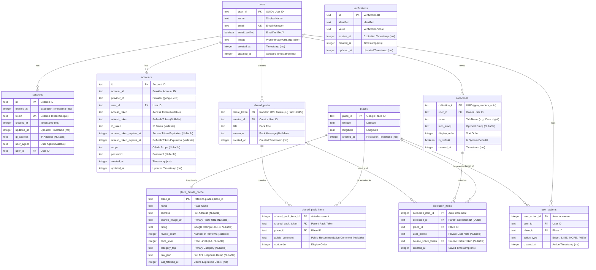

```mermaid
erDiagram
    %% ==========================================
    %% 1. ユーザー管理 (User Management) - Better Auth
    %% ==========================================
    users {
        text user_id PK "UUID / User ID"
        text name "Display Name"
        text email UK "Email (Unique)"
        boolean email_verified "Email Verified?"
        text image "Profile Image URL (Nullable)"
        integer created_at "Timestamp (ms)"
        integer updated_at "Updated Timestamp (ms)"
    }

    sessions {
        text id PK "Session ID"
        integer expires_at "Expiration Timestamp (ms)"
        text token UK "Session Token (Unique)"
        integer created_at "Timestamp (ms)"
        integer updated_at "Updated Timestamp (ms)"
        text ip_address "IP Address (Nullable)"
        text user_agent "User Agent (Nullable)"
        text user_id FK "User ID"
    }

    accounts {
        text id PK "Account ID"
        text account_id "Provider Account ID"
        text provider_id "Provider (google, etc.)"
        text user_id FK "User ID"
        text access_token "Access Token (Nullable)"
        text refresh_token "Refresh Token (Nullable)"
        text id_token "ID Token (Nullable)"
        integer access_token_expires_at "Access Token Expiration (Nullable)"
        integer refresh_token_expires_at "Refresh Token Expiration (Nullable)"
        text scope "OAuth Scope (Nullable)"
        text password "Password (Nullable)"
        integer created_at "Timestamp (ms)"
        integer updated_at "Updated Timestamp (ms)"
    }

    verifications {
        text id PK "Verification ID"
        text identifier "Identifier"
        text value "Verification Value"
        integer expires_at "Expiration Timestamp (ms)"
        integer created_at "Timestamp (ms)"
        integer updated_at "Updated Timestamp (ms)"
    }

    %% ==========================================
    %% 2. 場所マスタ & キャッシュ (Places & Cache)
    %% ==========================================
    %% 場所の不変ID（外部キー参照用）
    places {
        text place_id PK "Google Place ID"
        real latitude "Latitude"
        real longitude "Longitude"
        integer created_at "First Seen Timestamp (ms)"
    }

    %% 場所の詳細情報（APIコスト削減用キャッシュ）
    %% 定期的にAPIから再取得して更新する (Cache-Aside Pattern)
    place_details_cache {
        text place_id PK "Refers to places.place_id"
        text name "Place Name"
        text address "Full Address (Nullable)"
        text cached_image_url "Primary Photo URL (Nullable)"
        real rating "Google Rating (1.0-5.0, Nullable)"
        integer review_count "Number of Reviews (Nullable)"
        integer price_level "Price Level (0-4, Nullable)"
        text category_tag "Primary Category (Nullable)"
        text raw_json "Full API Response Dump (Nullable)"
        integer last_fetched_at "Cache Expiration Check (ms)"
    }

    %% ==========================================
    %% 3. コレクション機能 (My Collection)
    %% ==========================================
    %% ユーザーが作成するタブ/フォルダ
    collections {
        text collection_id PK "UUID (gen_random_uuid)"
        text user_id FK "Owner User ID"
        text name "Tab Name (e.g. 'Date Night')"
        text icon_emoji "Optional Emoji (Nullable)"
        integer display_order "Sort Order"
        boolean is_default "Is System Default?"
        integer created_at "Timestamp (ms)"
    }

    %% コレクション内のアイテム（保存したお店）
    collection_items {
        integer collection_item_id PK "Auto Increment"
        text collection_id FK "Parent Collection ID (UUID)"
        text place_id FK "Place ID"
        text user_memo "Private User Note (Nullable)"

        %% 【重要】シェア経由の追跡用 (Nullable)
        %% 自分が検索して保存 = NULL
        %% シェアから保存 = Shared Pack Token
        text source_share_token FK "Source Share Token (Nullable)"

        integer created_at "Saved Timestamp (ms)"
    }

    %% ==========================================
    %% 4. シェア機能 (Social Sharing)
    %% ==========================================
    %% 共有パッケージ（URL発行単位）
    shared_packs {
        text share_token PK "Random URL Token (e.g. 'abc12345')"
        text creator_id FK "Creator User ID"
        text title "Pack Title"
        text message "Pack Message (Nullable)"
        integer created_at "Created Timestamp (ms)"
    }

    %% 共有パッケージの中身
    shared_pack_items {
        integer shared_pack_item_id PK "Auto Increment"
        text shared_pack_token FK "Parent Pack Token"
        text place_id FK "Place ID"
        text public_comment "Public Recommendation Comment (Nullable)"
        integer sort_order "Display Order"
    }

    %% ==========================================
    %% 5. 行動ログ (User Actions)
    %% ==========================================
    %% スワイプ履歴（二度と表示しない制御 & 好み学習用）
    user_actions {
        integer user_action_id PK "Auto Increment"
        text user_id FK "User ID"
        text place_id FK "Place ID"
        text action_type "Enum: 'LIKE', 'NOPE', 'VIEW'"
        integer created_at "Action Timestamp (ms)"
    }

    %% ==========================================
    %% Relationships
    %% ==========================================

    %% Better Auth Relations
    users ||--o{ sessions : "has"
    users ||--o{ accounts : "has"

    %% User Relations
    users ||--o{ collections : "owns"
    users ||--o{ shared_packs : "creates"
    users ||--o{ user_actions : "logs"

    %% Place Relations
    places ||--|| place_details_cache : "has details"
    places ||--o{ collection_items : "is saved in"
    places ||--o{ shared_pack_items : "is included in"
    places ||--o{ user_actions : "is target of"

    %% Collection Relations
    collections ||--o{ collection_items : "contains"

    %% Shared Pack Relations
    shared_packs ||--o{ shared_pack_items : "contains"

    %% 【重要】シェアとコレクションの緩やかな繋がり
    %% シェアパックが消えてもコレクションアイテムは残る (SET NULL)
    shared_packs |o--o{ collection_items : "source of"
```
