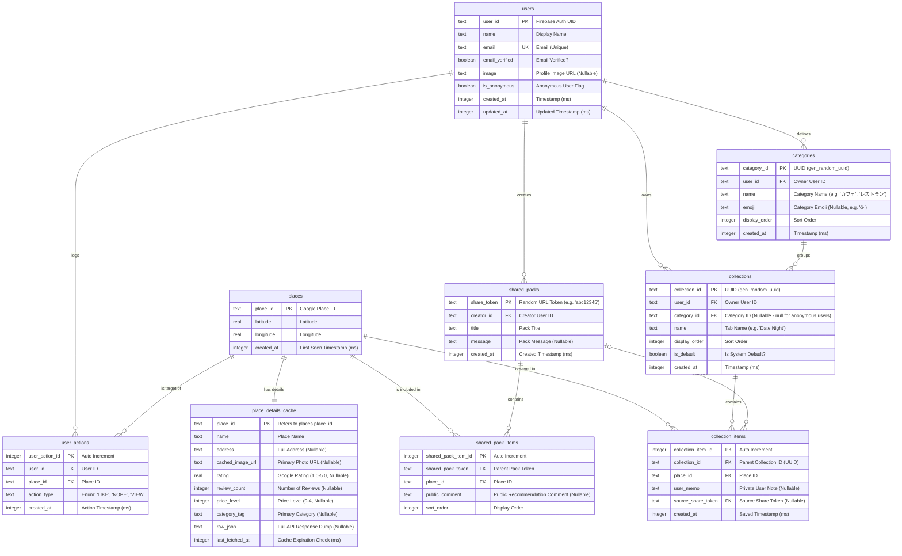

## 匿名ユーザー vs ログインユーザー

| 機能 | 匿名ユーザー | ログインユーザー |
|------|-------------|-----------------|
| コレクション作成 | ✅ | ✅ |
| 場所の保存 | ✅ | ✅ |
| カテゴリー作成・編集 | ❌ | ✅ |
| コレクションにカテゴリー設定 | ❌ | ✅ |
| シェアパック作成 | ❌ | ✅ |
| アカウント連携 | → ログインに変換 | - |

匿名ユーザーがGoogle OAuthでサインインすると、`onLinkAccount`コールバックにより既存のデータ（collections, user_actions）が自動的に新アカウントに移行されます。
